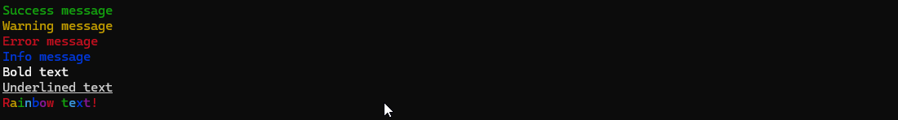
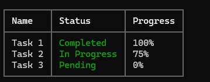
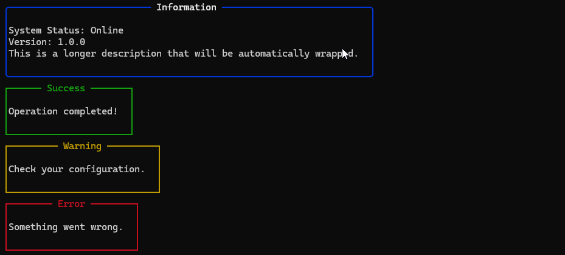
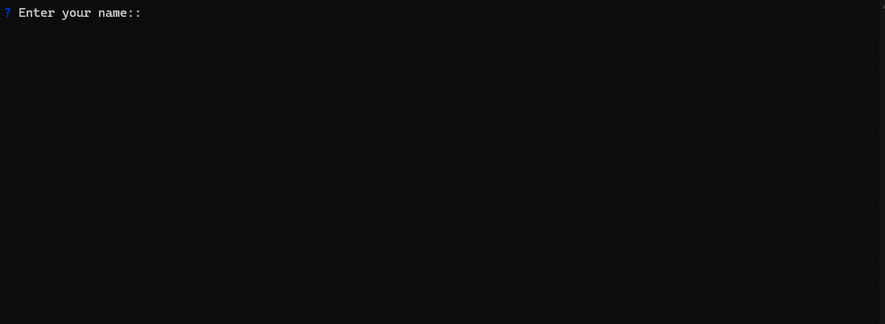
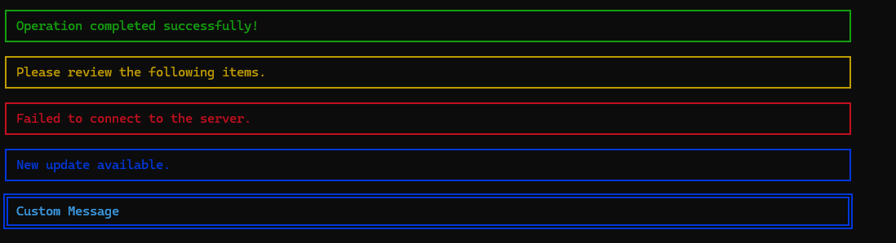

# Clime 🎨

A beautiful and feature-rich Command Line Interface library for Go that makes building stunning terminal applications effortless.

[](https://golang.org/doc/install)
[](LICENSE)
[]()

## ✨ Features

Clime provides a comprehensive set of tools for creating beautiful command-line interfaces:

### 🎯 Core Components
- **Terminal Utilities** - Clear screen, cursor movement, size detection
- **Rich Colors & Formatting** - 16+ colors, bold, italic, underline, rainbow effects
- **Interactive Spinners** - Multiple styles with customizable colors and messages
- **Progress Bars** - Single and multi-bar support with ETA and rate display
- **Styled Banners** - Success, warning, error, and info messages
- **Data Tables** - Formatted tables with column styling and alignment
- **Decorative Boxes** - Multiple border styles with titles and content wrapping
- **User Input** - Text, password, email, number, and confirmation prompts
- **Autocomplete** - Smart suggestions with fuzzy matching

### 🎨 Visual Elements
- **Spinner Styles**: Default, Clock, Dots, Arrow, Modern
- **Progress Styles**: Modern, Arrow, Dots, Classic
- **Box Styles**: Default, Rounded, Bold, Double
- **Banner Types**: Success, Warning, Error, Info with custom icons
- **Color Support**: Full palette including bright colors and gradients

### 🖥️ Platform Support
- **Cross-platform**: Windows, macOS, Linux
- **Terminal Detection**: Automatic TTY detection and sizing
- **Responsive Design**: Adapts to terminal width and height

## 📦 Installation

```bash
go get github.com/alperdrsnn/clime
```

## 🚀 Quick Start

```go
package main

import (
    "fmt"
    "time"
    "github.com/alperdrsnn/clime"
)

func main() {
    // Welcome header
    clime.Header("Welcome to My App")
    
    // Colored messages
    clime.SuccessLine("Application started successfully!")
    clime.InfoLine("Loading configuration...")
    
    // Spinner with custom message
    spinner := clime.NewSpinner().
        WithMessage("Initializing...").
        WithColor(clime.BlueColor).
        Start()
    time.Sleep(2 * time.Second)
    spinner.Success("Initialization complete!")
    
    // Progress bar
    bar := clime.NewProgressBar(100).
        WithLabel("Processing").
        ShowETA(true)
        
    for i := 0; i <= 100; i += 10 {
        bar.Set(int64(i))
        bar.Print()
        time.Sleep(200 * time.Millisecond)
    }
    bar.Finish()
    
    // Interactive input
    name, _ := clime.Ask("What's your name?")
    clime.SuccessLine(fmt.Sprintf("Hello, %s! 👋", name))
    
    // Responsive box that adapts to terminal size
    clime.NewBox().
        WithTitle("Responsive Demo").
        WithSmartWidth(0.8).  // 80% of terminal width
        AddLine("This box adapts to your terminal size!").
        AddLine("Try resizing your terminal and running again.").
        Println()
}
```


## 📚 Usage Examples

### Colors and Text Formatting

```go
// Basic colors
fmt.Println(clime.Success.Sprint("Success message"))
fmt.Println(clime.Warning.Sprint("Warning message"))
fmt.Println(clime.Error.Sprint("Error message"))
fmt.Println(clime.Info.Sprint("Info message"))

// Text styling
fmt.Println(clime.BoldColor.Sprint("Bold text"))
fmt.Println(clime.UnderlineColor.Sprint("Underlined text"))
fmt.Println(clime.Rainbow("Rainbow text!"))
```


### Spinners

```go
// Basic spinner
spinner := clime.NewSpinner().
    WithMessage("Loading...").
    Start()
time.Sleep(2 * time.Second)
spinner.Success("Done!")

// Styled spinner
spinner2 := clime.NewSpinner().
    WithStyle(clime.SpinnerClock).
    WithColor(clime.MagentaColor).
    WithMessage("Processing...").
    Start()
time.Sleep(3 * time.Second)
spinner2.Success("Complete!")
```


### Progress Bars

```go
// Single progress bar
bar := clime.NewProgressBar(100).
    WithLabel("Download").
    WithStyle(clime.ProgressStyleModern).
    WithColor(clime.GreenColor).
    ShowRate(true)

for i := 0; i <= 100; i += 5 {
    bar.Set(int64(i))
    bar.Print()
    time.Sleep(100 * time.Millisecond)
}
bar.Finish()

time.Sleep(1500 * time.Millisecond)
clime.Clear()

// Multi-progress bars
multiBar := clime.NewMultiBar()
bar1 := clime.NewProgressBar(100).WithLabel("Task 1")
bar2 := clime.NewProgressBar(80).WithLabel("Task 2")
multiBar.AddBar(bar1).AddBar(bar2)

for i := 0; i <= 100; i += 2 {
    if i <= 100 {
        bar1.Set(int64(i))
    }
    if i <= 80 {
        bar2.Set(int64(i))
    }
    multiBar.Print()
    time.Sleep(50 * time.Millisecond)
}
```


### Tables

```go
table := clime.NewTable().
    AddColumn("Name").
    AddColumn("Status").
    AddColumn("Progress").
    SetColumnColor(1, clime.Success).
    AddRow("Task 1", "Completed", "100%").
    AddRow("Task 2", "In Progress", "75%").
    AddRow("Task 3", "Pending", "0%")

table.Print()
```


### Boxes

```go
// Simple box
box := clime.NewBox().
    WithTitle("Information").
    WithBorderColor(clime.BlueColor).
    WithStyle(clime.BoxStyleRounded).
    AddLine("System Status: Online").
    AddLine("Version: 1.0.0").
    AddText("This is a longer description that will be automatically wrapped.")

box.Println()

// Quick boxes
clime.PrintSuccessBox("Success", "Operation completed!")
clime.PrintWarningBox("Warning", "Check your configuration.")
clime.PrintErrorBox("Error", "Something went wrong.")
```


### Interactive Input

```go
// Basic input
name, err := clime.Ask("Enter your name:")

// Email validation
email, err := clime.AskEmail("Enter your email:")

// Password input (masked)
password, err := clime.AskPassword("Enter password:")

// Number input
age, err := clime.AskNumber("Enter your age:")

// Confirmation
confirmed, err := clime.AskConfirm("Continue?", true)

// Single choice with arrow key navigation
frameworks := []string{"React", "Vue", "Angular", "Svelte"}
choice, err := clime.AskChoice("Select framework:", frameworks...)

// Multi-choice with arrow key navigation
languages := []string{"Go", "JavaScript", "Python", "Rust"}
choices, err := clime.AskMultiChoice("Select languages:", languages...)

// Autocomplete with arrow key navigation
options := []string{"apple", "banana", "cherry", "date"}
choice, err := clime.AskWithOptions("Choose a fruit:", options)

// Advanced autocomplete
choice, err := clime.AutoComplete(clime.AutoCompleteConfig{
    Label: "Choose a fruit:",
    Options: options,
    FuzzyMatch: true,
    MaxResults: 5,
})
```


### Responsive Design

```go
// Smart width sizing (adapts to terminal width)
clime.NewBox().
    WithTitle("Responsive Box").
    WithSmartWidth(0.7).  // 70% of terminal width
    AddLine("This box adapts to terminal size").
    Println()

// Breakpoint-specific configurations
box := clime.NewBox().
    WithTitle("Multi-Breakpoint Box").
    WithResponsiveConfig(clime.ResponsiveConfig{
        XS: &clime.ElementConfig{Width: 30, Padding: 1, Compact: true},
        SM: &clime.ElementConfig{Width: 50, Padding: 2},
        MD: &clime.ElementConfig{Width: 70, Padding: 2},
        LG: &clime.ElementConfig{Width: 90, Padding: 3},
        XL: &clime.ElementConfig{Width: 120, Padding: 3, ShowFull: true},
    }).
    AddLine("Width and padding change based on terminal size").
    AddLine("Try resizing your terminal and running again!")

box.Println()

// Responsive utility functions
if clime.IsXS() {
    clime.InfoLine("Very small terminal detected - using compact layout")
} else if clime.IsMDOrLarger() {
    clime.InfoLine("Large terminal detected - using full layout")
}

// Smart spacing
padding := clime.SmartPadding()  // 0-2 based on screen size
margin := clime.SmartMargin()    // 1-8 based on screen size

// Optimal column calculation
columns := clime.GetOptimalColumns(20)  // Content width: 20 chars
fmt.Printf("Optimal columns for this terminal: %d\n", columns)

// Manual refresh after terminal resize
rm := clime.GetResponsiveManager()
rm.RefreshBreakpoint()
fmt.Printf("Current breakpoint: %s\n", rm.GetCurrentBreakpointName())
```

### Banners

```go
clime.SuccessBanner("Operation completed successfully!")
clime.WarningBanner("Please review the following items.")
clime.ErrorBanner("Failed to connect to the server.")
clime.InfoBanner("New update available.")

// Custom banner
clime.NewBanner("Custom Message", clime.BannerInfo).
    WithStyle(clime.BannerStyleDouble).
    WithColor(clime.CyanColor).
    Println()
```


### Terminal Utilities

```go
// Terminal information
terminal := clime.NewTerminal()
width := terminal.Width()
height := terminal.Height()
isInteractive := terminal.IsATTY()

// Screen control
clime.Clear()                    // Clear screen
clime.HideCursor()              // Hide cursor
clime.ShowCursor()              // Show cursor
clime.MoveCursorUp(3)           // Move cursor up 3 lines
clime.ClearLine()               // Clear current line
```

## 🎛️ Configuration Options

### Spinner Styles
- `SpinnerDefault` - Classic spinning animation
- `SpinnerClock` - Clock-like rotation
- `SpinnerDots` - Bouncing dots
- `SpinnerArrow` - Rotating arrow

### Progress Bar Styles
- `ProgressStyleModern` - Clean modern look
- `ProgressStyleArrow` - Arrow-based indicator
- `ProgressStyleDots` - Dotted progress
- `ProgressStyleClassic` - Traditional bar

### Box Styles
- `BoxStyleDefault` - Standard borders
- `BoxStyleRounded` - Rounded corners
- `BoxStyleBold` - Thick borders
- `BoxStyleDouble` - Double-line borders

### Banner Styles
- `BannerStyleSingle` - Single line border
- `BannerStyleDouble` - Double line border
- `BannerStyleThick` - Thick border

## 🎨 Color Palette

Clime supports a full range of colors:

**Standard Colors**: Black, Red, Green, Yellow, Blue, Magenta, Cyan, White
**Bright Colors**: BrightRed, BrightGreen, BrightYellow, BrightBlue, etc.
**Special Effects**: Rainbow text, gradients, background colors

## 📱 Responsive Design System

Clime includes a comprehensive responsive design system that adapts UI components to different terminal sizes, ensuring optimal user experience across various environments.

### 🎯 Breakpoint System

The responsive system uses 5 breakpoints to categorize terminal widths:

```go
XS: 0-59 chars    // Very small (mobile terminal, narrow SSH)
SM: 60-79 chars   // Small (default terminal)  
MD: 80-119 chars  // Medium (standard terminal)
LG: 120-159 chars // Large (wide terminal)
XL: 160+ chars    // Extra Large (ultra-wide displays)
```

### 🛠️ Smart Sizing Functions

#### SmartWidth
Automatically calculates element width based on terminal size and breakpoint:
```go
// 80% of terminal width with smart margins
box := clime.NewBox().WithSmartWidth(0.8)
```

#### SmartPadding & SmartMargin
Adaptive spacing that scales with screen size:
```go
// XS: 0 padding, SM: 1, MD: 1, LG: 2, XL: 2
padding := clime.SmartPadding()

// XS: 1 margin, SM: 2, MD: 4, LG: 6, XL: 8  
margin := clime.SmartMargin()
```

### 🎛️ Responsive Configuration

Define different configurations for each breakpoint:

```go
box := clime.NewBox().
    WithTitle("Responsive Box").
    WithResponsiveConfig(clime.ResponsiveConfig{
        XS: &clime.ElementConfig{Width: 30, Padding: 1, Compact: true},
        SM: &clime.ElementConfig{Width: 40, Padding: 2},
        MD: &clime.ElementConfig{Width: 60, Padding: 2},
        LG: &clime.ElementConfig{Width: 80, Padding: 3},
        XL: &clime.ElementConfig{Width: 100, Padding: 3, ShowFull: true},
    })
```

### 🔧 Utility Functions

```go
// Breakpoint detection
if clime.IsXS() {
    // Compact layout for very small terminals
} else if clime.IsMDOrLarger() {
    // Full-featured layout for larger terminals
}

// Optimal column calculation
columns := clime.GetOptimalColumns(contentWidth)
// XS: max 1, SM: max 2, MD: max 3, LG: max 4, XL: max 6

// Manual breakpoint refresh (after terminal resize)
rm := clime.GetResponsiveManager()
rm.RefreshBreakpoint()
```

### 🎪 Use Cases

**Perfect for:**
- **Dashboard Applications**: Different layouts for different screen sizes
- **Data Visualization**: Adaptive tables and charts
- **Interactive CLIs**: Responsive menus and forms
- **Monitoring Tools**: Compact vs detailed views

**Example scenarios:**
- SSH terminal (narrow) → Compact, single-column layout
- Standard terminal → Balanced layout with moderate spacing
- Ultra-wide display → Multi-column layout with generous spacing

### 🚀 Future Enhancements

- [ ] **Live Responsive Updates**: Real-time adaptation without restart
- [ ] **Custom Breakpoints**: User-defined breakpoint values
- [ ] **Responsive Tables**: Column hiding/showing based on width
- [ ] **Adaptive Spinners**: Size-appropriate loading indicators
- [ ] **Smart Text Wrapping**: Intelligent content reflow

## Supported Features

### ✅ Current Features

- [x] **Terminal Management**: Screen clearing, cursor control, size detection
- [x] **Color System**: 16+ colors, text styling, rainbow effects  
- [x] **Spinners**: 4+ styles with customizable colors and messages
- [x] **Progress Bars**: Single and multi-bar with ETA/rate display
- [x] **Data Tables**: Column styling, alignment, color support
- [x] **Decorative Boxes**: 4+ border styles with title support
- [x] **Interactive Prompts**: Text, password, email, number input with arrow key navigation
- [x] **Autocomplete**: Fuzzy matching, customizable options
- [x] **Banners**: Success, warning, error, info with icons
- [x] **Cross-platform**: Windows, macOS, Linux support
- [x] **TTY Detection**: Automatic terminal capability detection
- [x] **Text Utilities**: Padding, truncation, wrapping
- [x] **Multiple Input Types**: Confirmation, selection, validation
- [x] **Responsive Design**: Breakpoint-based adaptive layouts and smart sizing

### 🚧 Planned Features (TODO)

- [ ] **Enhanced Tables**: Row separators and advanced formatting
- [ ] **Live Responsive Updates**: Real-time terminal resize detection and adaptation
- [ ] **Responsive Tables**: Column hiding/showing based on terminal width
- [ ] **Custom Breakpoints**: User-defined breakpoint values and responsive rules
- [ ] **Windows Integration**: Native Windows API for improved terminal size detection
- [ ] **Theme System**: Predefined color themes and custom theme support
- [ ] **Advanced Layouts**: Grid systems and complex UI layouts
- [ ] **Animation System**: Custom animations and transitions
- [ ] **Configuration Files**: JSON/YAML configuration support
- [ ] **Logging Integration**: Built-in logging with styled output
- [ ] **Plugin System**: Extensible component architecture
- [ ] **Interactive Menus**: Navigation menus and selection interfaces
- [ ] **Chart Components**: Simple ASCII charts and graphs

## 🤝 Contributing

Contributions are welcome! Here's how you can help:

1. **Fork** the repository
2. **Create** a feature branch (`git checkout -b feature/amazing-feature`)
3. **Commit** your changes (`git commit -m 'Add amazing feature'`)
4. **Push** to the branch (`git push origin feature/amazing-feature`)
5. **Open** a Pull Request

### Development Setup

```bash
# Clone the repository
git clone https://github.com/alperdrsnn/clime.git
cd clime

# Install dependencies
go mod tidy

# Run examples
go run examples/basic_example.go
go run examples/interactive_example.go
go run examples/advanced_example.go
```